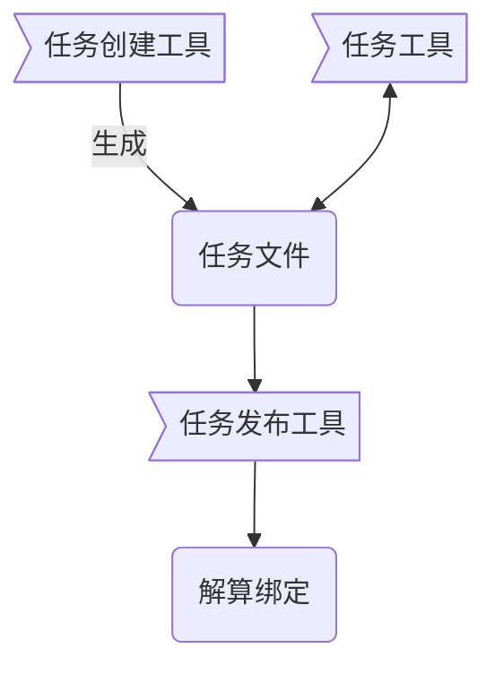
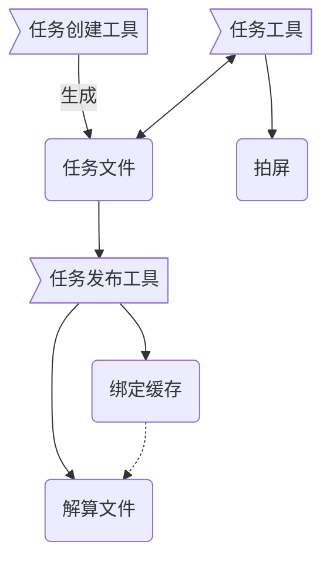

## 资产解算绑定工具
### 任务制作流程

#### 任务创建/管理工具
>选择相应项目的角色生成制作解算绑定的任务文件
- 自动生成任务文件
- 生成标准的层级结构
- 管理工作区域
#### 任务工具
>用于辅助解算绑定的制作，如创建基础的组，自动复制并模型到桥接模型或者解算模型
- 层级结构创建
- 复制桥接或者解算模型
- 上传参数模版（这个等基础功能出来了再做，这个参数模版跟资产绑定）
#### 任务发布工具
>用于发布解算绑定到项目目录，初版暂时没有检查功能
- 发布源文件
- 发布解算绑定
---
## 镜头解算工具
### 任务制作流程

#### 任务创建/管理工具
>选择相应项目的镜头生成解算任务文件
- 自动生成任务文件
- 管理工作区域
#### 任务工具
> 用于辅助解算制作
- 后台/农场拍屏
- 后台/农场输出缓存
- 增加/移除解算角色
- 更新缓存
- 更新解算绑定
- 加载参数模版（这个等基础功能出来了再做）
#### 任务发布工具
>用于发布解算缓存，并生成最终带缓存的镜头文件
- 发布源文件
- 后台/农场输出缓存
- 生成解算文件
