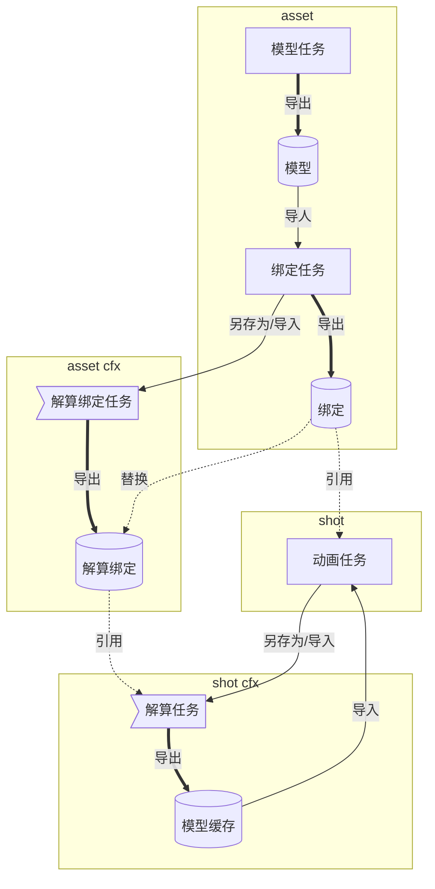

## 流程图

```mermaid

graph TD;
subgraph asset
	modeling["模型任务"]
	rigging["绑定任务"]

	model[(模型)]
	rig[("绑定")]

end

subgraph shot
	animation["动画任务"]
end

subgraph asset cfx
	cfx_rigging>"解算绑定任务"]
	cfx_rig[("解算绑定")]
end

subgraph shot cfx
	cfx>"解算任务"]
	cfx_cache[("模型缓存")]
end

modeling =="导出"==> model

model --"导人"--> rigging

rigging =="导出"==> rig

rigging --"另存为/导入"--> cfx_rigging

cfx_rigging =="导出"==> cfx_rig

rig -."引用".-> animation

cfx_rig -."引用".-> cfx

rig -."替换".-> cfx_rig

animation --"另存为/导入"--> cfx

cfx =="导出"==> cfx_cache

cfx_cache --"导入"--> animation
```
## 层级结构

- root（根组）
	- cfx_grp
		- cfx_cloth_grp（需要输出缓存的布料模型）
		- ~~cfx_hair_grp~~
		- cfx_collider_grp（碰撞模型）
		- cfx_dynamic_grp（解算器等）
		- cfx_auxiliary_grp（辅助物体，包裹体等）
