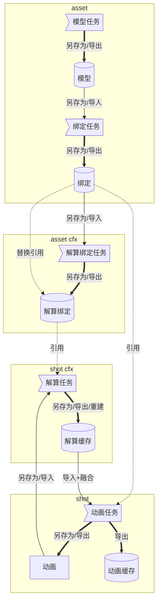
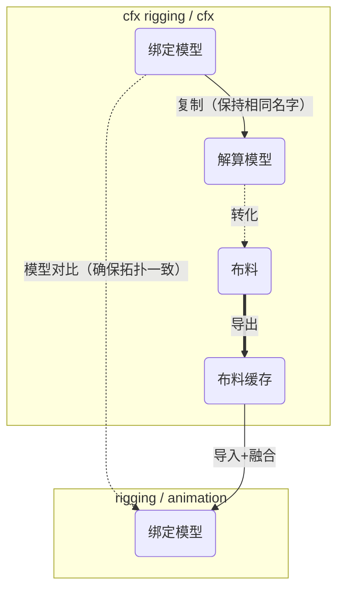

## 解算任务示意图

> 资产环节增加解算绑定任务，制作解算绑定用于镜头解算
>

## 解算绑定制作示意图

## 推荐层级结构/命名
>会有工具自动创建主要的组
>推荐全小写命名，避免因为大小写导致的命名错误，每个分组的子组推荐命名方式为"\{name\}\_grp"

- root（根组）
	- cfx_grp
		- cfx_cloth_grp（需要输出缓存的布料模型，确保模型的名字与绑定的名字是一致的，方便后面做拓扑对比，可以只有打组）
			- \{name\}\_grp
		- ~~cfx_hair_grp~~
		- cfx_collider_grp（碰撞模型，不会输出缓存）
			-  \{name\}\_grp
		- cfx_dynamic_grp（解算器等）
			- \{name\}\_grp
		- cfx_auxiliary_grp（辅助物体，包裹体等， 不会输出缓存）
			- \{name\}\_grp
