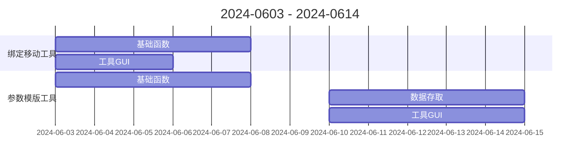
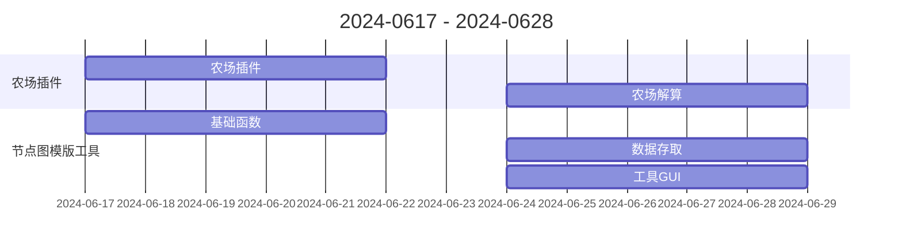
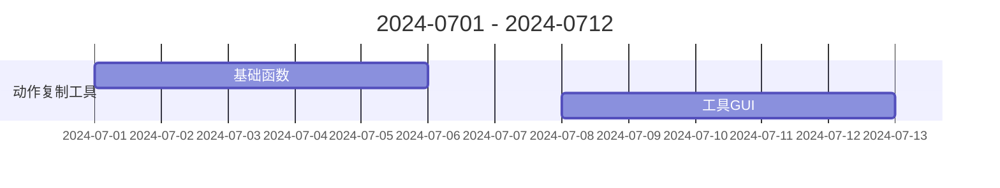

## 六月
### [[绑定移动工具]]+[[节点参数模版工具]]

```mermaid
gantt
    title 2024-0603 - 2024-0614
    dateFormat  YYYY-MMDD
    section 绑定移动工具
    基础函数 :a1, 2024-0603, 2024-0608
    工具GUI :a1, 2024-0603, 3d
	section 参数模版工具
	基础函数 :a1, 2024-0603, 5d
	数据存取 :a1, 2024-0610, 5d
	工具GUI :a1, 2024-0610, 5d
```
## [[节点图模版工具]]+[[农场插件]]+[[农场解算发布工具]]

```mermaid
gantt
    title 2024-0617 - 2024-0628
    dateFormat  YYYY-MMDD
    section 农场插件
    农场插件 :a1, 2024-0617, 5d
    农场解算 :a1, 2024-0624, 5d
    section 节点图模版工具
    基础函数 :a1, 2024-0617, 5d
    数据存取 :a1, 2024-0624, 5d
    工具GUI :a1, 2024-0624, 5d
```
## 七月
### [[动作复制工具]]

```mermaid
gantt
    title 2024-0701 - 2024-0712
    dateFormat  YYYY-MMDD
    section 动作复制工具
    基础函数 :a1, 2024-0701, 5d
    工具GUI :a1, 2024-0708, 5d

```