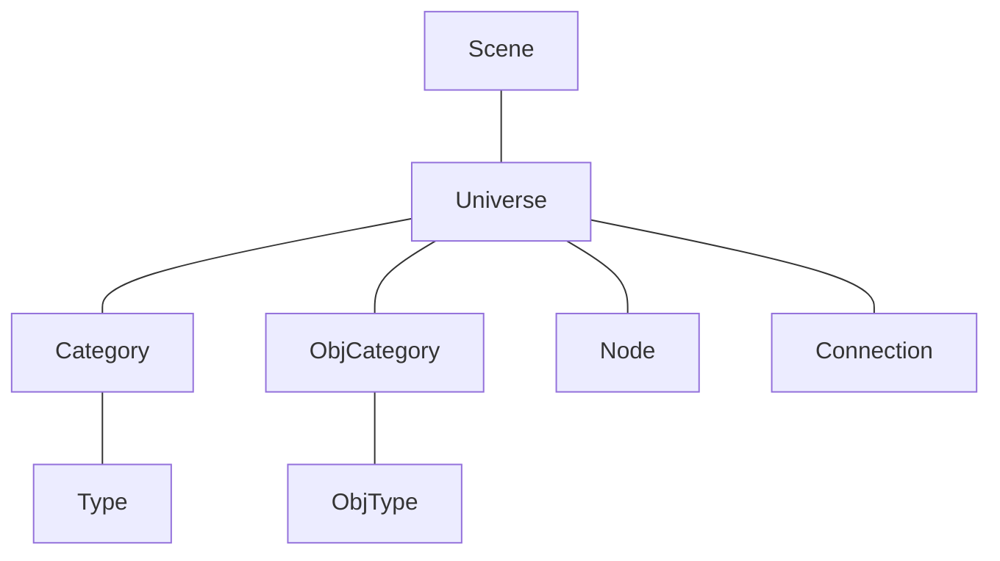

# arnold node abstract

## basic
- Scene
    - Universe
        - Category
            - Type
            - ...
        - ...
        - ObjCategory
            - ObjType
            - ...
        - ...
        - Node
            - Input
                - Channel
                - ...
                - Element
                    - Channel
                    - ...
             - ...
            - Output
                - Channel
                - ...
        - ...
        - Connection
        - ...

## graphic

